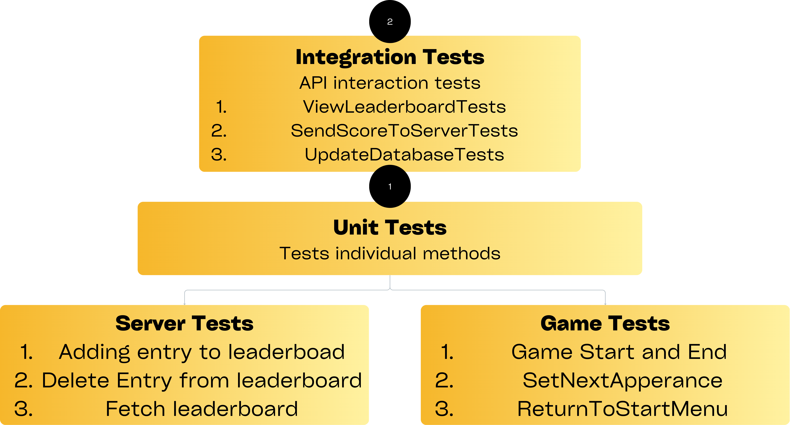

# CS455 Assigment-1 
This repository consists of the codebase for the Whack'Em All project, completed as the first Assignment for the course CS455: Introduction to Software Engineering, under Prof. Sruti S Ragavan, Department of CSE, IIT Kanpur

## Release Notes
**Version** : 4.0 

**Date** : 14 November 2024

**Notes** : 
1. Added functionality for testing load-time, [here](./perftest/load_time.py).
2. Added functionality for load testing the server, check for instructions below.
3. Added a [load_balancer](./server/load_balancer.js) for distributing load between two parallel servers, along with backup server to redirect requests when no server is available.
4. Added nightly load tests for server and game service

## Links

- The source code for the game is in the `src/` folder and can be accessed using [this](src/) link.
- The `TestProject/` folder contains the unit tests, integration tests and coverage report of the source code and can be accessed using [this](TestProject/) link.
- The `server/` folder consists of the code for the backend logic for leaderboard and the tests for the same, can be accessed by [this](server/) link.
- The `Documentation` [folder](Documentation/) consists of the Architecture Diagram and Test Pyramid Diagram.
- The game is deployed on GitHub pages and can be accessed by following [this](https://cs455-project.github.io/CS455-Assignment-1/) link.
- For detailed code quality and coverage analysis, visit our [SonarCloud project page](https://sonarcloud.io/project/overview?id=CS455-Project_CS455-Assignment-1).
- The `perftest/` folder consists the load-time, ['load_time.py'](./perftest/load_time.py) and load tests ([`load-test.yml`](./perftest/load-test.yml)) 

## Team 
|    **Name**  | **Roll Number** |
|--------------|-----------------|
| Arush Upadhyaya | 220213 |
| Wattamwar Akanksha Balaji | 221214 |


## Description 
1. The game involves a grid, which has, at any point in time, exactly of its cell occupied by the character. 
2. The goal is to hit the character by clicking on it, which awards the player an increment in score by 1.
3. The player is supposed to achieve the maximum possible score within 1 minute.

## Architecture Diagram

<p align="center">
        
</p>

## Test Pyramid

<p align="center">
        
</p>


## Requirements 
- For local deployment, this app requires `.NET Core SDK 8.0.107` and `node.js` to be installed on the system.
- For running load-time tests, please install Chrome WebDriver

## Instructions 
To run the application locally, follow the following steps &rarr;
1. In the directory of your choice, clone this repo 
```bash
git clone https://github.com/CS455-Project/CS455-Assignment-1
```
2. To run locally, make sure you are in the `src/` directory and run &rarr;
```bash
dotnet watch
```
3. If the local server has to be run then open another terminal instance and run the server &rarr;
```bash
npm install # install dependencies
node server.js
```
4. However the server is connected to MongoDB with a private connection string, so leaderboad cannot be accessed locally.

5. Within a few seconds, this should direct you to your browser, with a locally running version of the game.

## Testing
The project uses the following tools for testing and quality assurance:

### Tools for Tests
- **xUnit**: This is the testing framework used for unit testing the application's code. It is known for its simplicity and ease of use.
- **bUnit**: This is used specifically for testing Blazor components. It allows for testing the UI components and their interactions in isolation.
- **NUnit**: A popular unit testing framework for .NET applications, known for its flexibility and rich set of attributes for organizing and running tests.
- **Moq**: A mocking library for .NET, used to create mock objects for testing dependencies, allowing for behavior verification and isolation of components.

### Tools for Code Quality
- **SonarCloud**: This tool has been integrated to enforce quality gates on the codebase. SonarCloud provides continuous inspection of code quality and helps identify bugs, code smells, and security vulnerabilities. Quality gates are used to ensure that the code meets predefined standards before it is merged or released.
  
- **SonarLint**: Along with SonarCloud, we used SonarLint explicitly as linters for our codebase.
  
- **dotCover**: This tool is used to create code coverage reports. It helps in identifying which parts of the code are covered by tests and which are not. Ensuring high code coverage is essential for maintaining code quality and reliability.

- **Jest**: Provides an easy-to-use interface for unit testing. It also includes built-in code coverage tools, allowing tracking test coverage and ensuring robust testing of the application's logic.

## Running Tests and Coverage Reports
1. To run dotnet tests, make sure you are in the `TestProject/` directory and run the following command &rarr;

```bash
dotnet test
```
To collect coverage, a windows machine has to be used, run &rarr;
```shell
dotnet dotcover test TestProject/TestProject.csproj --dcReportType=HTML
```
 
2. To run server tests, make sure you are in the `server/` directory and run the following command &rarr;
```bash
npm test
```
Coverage will be collected in the `server/coverage/` directory and can be seen by opening the html file in a browser.

3. To run the perftests, switch to the `perftest/` directory &rarr;
- Install requirments &rarr;
```bash
pip install -r requirements.txt
npm install -g artillery 
```
- For load-time tests, run 
```bash
python load_time.py
```

The report is saved as an html file in `perftest/performance_reports` and can be viewed in a browser, along with graph displaying load time, resource size distribution and average timing

- For load-tests for game, run 
```bash
artillery run --target https://cs455-project.github.io/CS455-Assignment-1/ --output report_game.json
artillery report -o report_game.html report_game.json
```
- For load-tests for server(with load balancing), run
```bash
artillery run --target  https://cs455-assignment-load-balancer.onrender.com --output report_server.json
artillery report -o report_server.html report_server.json
```
- For load-tests for individual server(without load balancing), run
```bash
artillery run --target  hhttps://cs455-assignment-1.onrender.com --output report_server_single.json
artillery report -o report_server_single.html report_server_single.json
```
